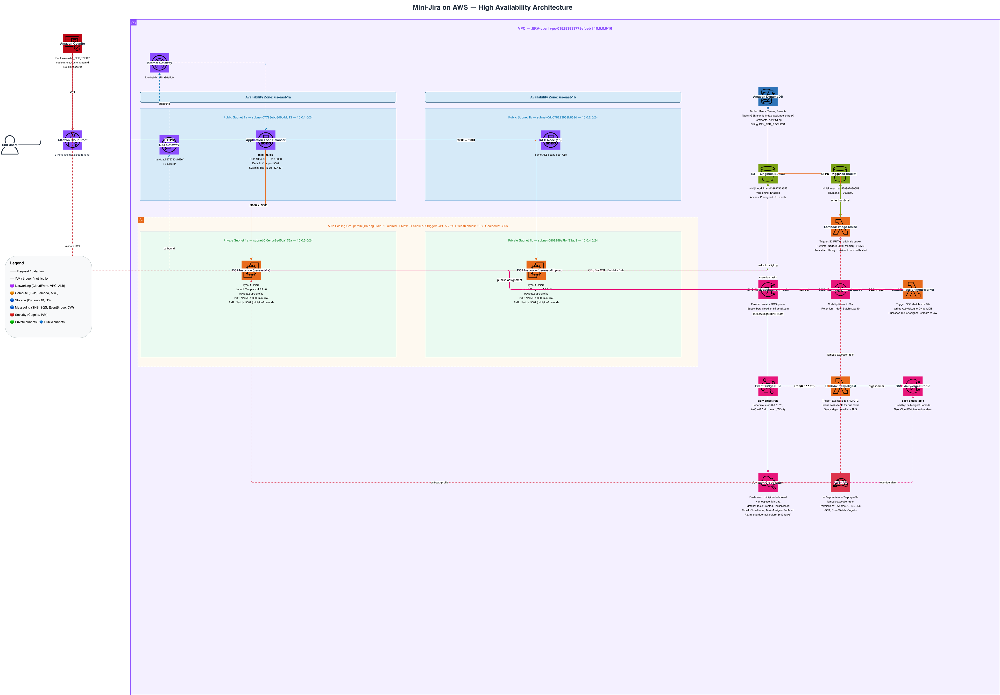

# Mini Jira — Full-Stack Task Management

## Architecture



> Built with official AWS Architecture Icons. Deployed across **us-east-1a** and **us-east-1b** for high availability.

### Architecture Overview

| Layer | Service | Details |
|---|---|---|
| **CDN** | CloudFront | `d1kjmg4gujmstj.cloudfront.net` — global edge delivery |
| **Network** | VPC | `10.0.0.0/16` — public + private subnets across 2 AZs |
| **Load Balancer** | ALB | `mini-jira-alb` — internet-facing, routes to EC2:3000 |
| **Compute** | EC2 + ASG | NestJS backend, Auto Scaling Group (min:1 max:2), 2 AZs |
| **Auth** | Cognito | User Pool `us-east-1_0EKgT0EKP` — JWT token validation |
| **Database** | DynamoDB | 6 tables: Tasks, Projects, Comments, Teams, Users, ActivityLog |
| **Storage** | S3 | Originals bucket + Resized bucket (Lambda-processed) |
| **Notifications** | SNS + SQS | task-assignment-topic fans out to email + SQS queue |
| **Image Pipeline** | Lambda | S3 trigger → `image-resize` → sharp 300×300 → resized bucket |
| **Worker** | Lambda | SQS trigger → `assignment-worker` → ActivityLog + CloudWatch |
| **Digest** | Lambda + EventBridge | `cron(0 6 * * ? *)` (9 AM GMT+3) → daily-digest email |
| **Monitoring** | CloudWatch | Dashboard + `overdue-tasks-alarm` → SNS |

## CloudFront URL
**https://d1kjmg4gujmstj.cloudfront.net**

## Quick Start

### Backend
```bash
cd backend
npm install
npm run start:dev    # development
npm run build        # production build
npm run start:prod   # production
```

### Frontend
```bash
cd frontend
npm install
npm run dev          # development (port 3001 or 3000)
npm run build        # production build
npm run start        # production
```

## Demo Scenario — Ali (Manager) → Sara + Omar

1. **Ali (manager)** logs in at https://d1kjmg4gujmstj.cloudfront.net/login
2. Ali creates teams: "Frontend Team" and "Backend Team"
3. Ali invites **Sara** (employee, Frontend Team) and **Omar** (employee, Backend Team)
4. Ali creates tasks:
   - "Design Landing Page" → assigned to Sara (Frontend Team)
   - "Set up API Gateway" → assigned to Omar (Backend Team)
5. **Sara** logs in → sees ONLY Frontend Team tasks (enforced server-side via DynamoDB GSI)
6. **Omar** logs in → sees ONLY Backend Team tasks (enforced server-side via DynamoDB GSI)
7. Sara drags "Design Landing Page" from To Do → In Progress on the Kanban board
   → CloudWatch metric `TimeToCloseHours` published on completion
8. Both receive SNS email notifications on task assignment via Lambda `assignment-worker`

## DynamoDB Tables
| Table | Partition Key | GSI |
|-------|--------------|-----|
| Users | userId | teamId-index (teamId) |
| Teams | teamId | — |
| Projects | projectId | teamId-index (teamId) |
| Tasks | taskId | teamId-index (teamId), assigneeId-index (assigneeId) |
| Comments | commentId | taskId (via query) |
| ActivityLog | logId | — |

## Lambda Functions
- **image-resize**: S3 trigger → sharp resize to 300×300 → save to resized bucket
- **assignment-worker**: SQS (from SNS) → write ActivityLog → publish CloudWatch metric
- **daily-digest**: EventBridge 6AM UTC → scan due tasks → publish SNS emails

## CORS
Backend allows: `https://d1kjmg4gujmstj.cloudfront.net`, `http://localhost:3000`, `http://localhost:3001`
